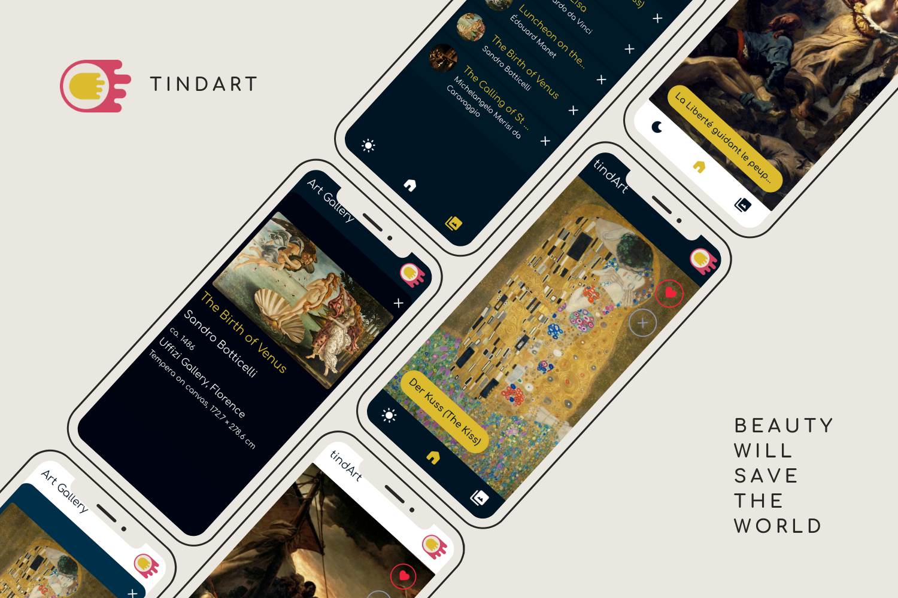

# tindArt

tindArt is a 'tinder for artworks' web application, its mission is making the process of discovering new artworks not only accessible but also fun and engaging for everyone.



## Getting started:
1. Clone the repo:

   ```bash
      git clone https://github.com/RiccardoMurru/tindArt.git
      cd tindart
    ```

2. Set .env in server folder:
   ```env
      API_URL=https://api.artsy.net/api
      API_TOKEN= your Artsy API token
      DB_NAME=tindart
      DB_PORT= your DB port
      DB_URL= your DB url
   ```
3. Set .env.local in client folder:
   ```env
      VITE_SERVER_URL= your server url
   ```
4. Install the dependencies and run the server:

   ```bash
      cd server && npm install
      node .
    ```
5. Install the dependencies and run the client:

   ```bash
      cd client && npm install
      npm run dev
    ```

## Tech stack:

tindArt uses:
- [Vue.js](https://vuejs.org/) as frontend framework
- [Pinia](https://pinia.vuejs.org/) for state management
- [Vite](https://vitejs.dev/) as build tool
- [TypeScript](https://www.typescriptlang.org/) language
- [Hammer.js](https://hammerjs.github.io/) for handling touch gestures
- [PostCSS](https://postcss.org/) for CSS plugins
- [Express](https://expressjs.com/) for backend server
- [MondoDB](https://www.mongodb.com/) as database
- [Mongoose](https://mongoosejs.com/) as ORM

## Third party APIs

tindArt fetches data from [Artsy API](https://developers.artsy.net/), an account and a secret key is needed for using the API.

## Author:

Riccardo Murru: [GitHub](https://github.com/RiccardoMurru/) - [Linkedin](https://www.linkedin.com/in/riccardomurru/)

